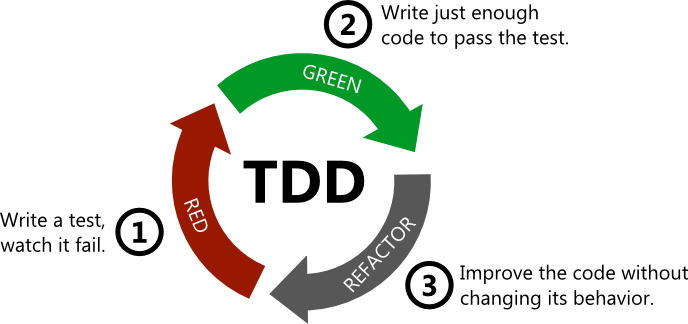

# Homework - TDD Practice

Solve this homework using **TDD – Test Driven Development**

## Goal

In this homework you will create a new class called **BankAccount**

The idea:

A bank account has a balance
You can deposit money, withdraw money, and check the current balance

## What you need to do

### Step 1

Create the class file from the starter code below

### Step 2

Create the test file from the starter code below

### Step 3

Write the tests first

### Step 4

Only after that – implement the functions in the class until all tests pass

## Important

Work in this order:

1. create one test
2. run the test and see it fail
3. implement just enough code to pass
4. move to the next test

That is the whole idea of **TDD**

## Class to create – `bank_account.py`

```python
class BankAccount:

    def __init__(self):
        self.balance = 0

    def deposit(self, amount):
        return None

    def withdraw(self, amount):
        return None

    def get_balance(self):
        return 0

    def is_empty(self):
        return False
```

## Test file to create – `test_bank_account_tdd.py`

```python
import pytest
from bank_account import BankAccount


def test_new_account_starts_with_zero_balance():
    # when a new account is created, balance should be 0
    pass


def test_deposit_money_once():
    # when I deposit 100 dollars, I expect the balance to be 100
    pass


def test_deposit_money_twice():
    # when I deposit 100 and then 50, I expect the balance to be 150
    pass


def test_withdraw_money():
    # when I deposit 100 and withdraw 30, I expect the balance to be 70
    pass


def test_balance_after_deposit_and_withdraw():
    # when I deposit 200, withdraw 50, and deposit 25, I expect the balance to be 175
    pass


def test_is_empty_returns_true_for_new_account():
    # when account is new, I expect is_empty to return True
    pass


def test_is_empty_returns_false_after_deposit():
    # when I deposit money, I expect is_empty to return False
    pass
```

## What the class should do

### `__init__()`

When a new bank account is created, it should start with a balance of `0`

### `deposit(amount)`

Adds money to the account balance

### `withdraw(amount)`

Removes money from the account balance

### `get_balance()`

Returns the current balance in the account

### `is_empty()`

Returns `True` if the balance is `0`
Otherwise returns `False`

## Your job

For each test function:

* read the description (the comment)
* write the test code
* run pytest
* only then implement the matching function in the class

## Suggested order

1. `test_new_account_starts_with_zero_balance`
2. `test_deposit_money_once`
3. `test_deposit_money_twice`
4. `test_withdraw_money`
5. `test_balance_after_deposit_and_withdraw`
6. `test_is_empty_returns_true_for_new_account`
7. `test_is_empty_returns_false_after_deposit`

## Small example of thinking in TDD

```python
def test_deposit_money_once():
    account = BankAccount()
    account.deposit(100)
    assert account.get_balance() == 100
```

## Bonus ideas – optional

* deposit `0`
* withdraw all the money
* deposit, withdraw, then deposit again

## Submission

Submit these two files:

* `bank_account.py`
* `test_bank_account_tdd.py`

## What I expect from you

1. First create the tests
2. Then implement the class
3. Make sure all tests pass
4. Keep the code clean and simple

📧 **Submission email:**
**[pythonai200425+pytesttdd@gmail.com](mailto:pythonai200425+pytesttdd@gmail.com)**

Good luck 💪
